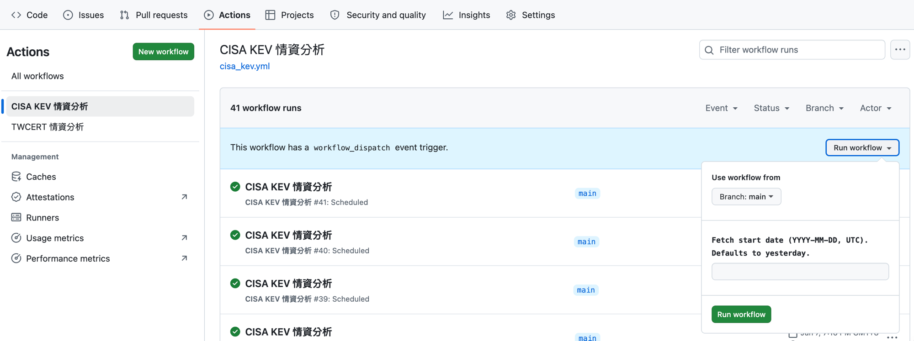

# 首次部署指南

本文件引導首次部署者從零開始完成所有外部服務設定，直到 GitHub Actions 能成功自動跑完整個 pipeline 為止。

> **已完成部署的維運者**請改看 [deployment.md](deployment.md)（CI 內部行為、workflow 排程、archive branch 機制）。

---

## 前置需求

| 需求 | 說明 |
|:--|:--|
| GitHub repo 管理員權限 | 需要設定 Secrets 與 Actions 設定 |
| Google 帳號 | 用於建立 GCP 專案與 Service Account |
| Google Cloud 專案 | 需能啟用 API（免費方案即可） |
| Google AI Studio 帳號 | 取得 Gemini API Key |
| TWCERT 企業會員帳號 | 僅 TWCERT workflow 需要；向 [TW-ISAC](https://www.twcert.org.tw/) 申請 |

---

## 1. 建立 Google Cloud Service Account

### 1-1. 建立或選擇 GCP 專案

前往 [Google Cloud Console](https://console.cloud.google.com/) → 頂部專案選單 → **新增專案**（或選擇現有專案）。記下 **專案 ID**（後續不用，但頁面需確認在正確的專案下）。

### 1-2. 啟用 API

在同一個 GCP 專案中啟用以下兩個 API：

**Navigation menu → APIs & Services → Enabled APIs & services → + Enable APIs and Services**

搜尋並啟用：
- **Google Sheets API**
- **Google Drive API**

（Drive API 是必要的：`gspread` 程式庫透過 Drive scope 開啟 Spreadsheet，見 `src/config.py:27-30`）

### 1-3. 建立 Service Account

**Navigation menu → IAM & Admin → Service Accounts → + Create Service Account**

1. **Service account name**：填入任意名稱，例如 `security-info-bot`
2. **Service account ID** 會自動產生（記下完整 email，格式為 `<id>@<project>.iam.gserviceaccount.com`）
3. 「Grant this service account access to project」這步**略過**（此 SA 不需要任何 IAM role；所有權限靠後續分享 Sheet 來給予）
4. 建立完成

### 1-4. 產生並下載 JSON Key

進入剛建立的 SA 頁面 → **Keys** 分頁 → **Add Key → Create new key → JSON → Create**

瀏覽器會自動下載一個 JSON 檔（例如 `project-id-123456789.json`）。**妥善保管此檔案，不要 commit 進 repo。**

---

## 2. 將 SA JSON 轉為 Base64

GitHub Secrets 只接受字串值，需將 JSON 檔編碼為 Base64 字串後貼入。

```bash
# macOS
base64 -i /path/to/sa-key.json | tr -d '\n'

# Linux
base64 -w0 /path/to/sa-key.json
```

複製輸出的整串字串（單行、無換行）—— 這就是 `GOOGLE_SA_JSON_B64` 的值。

> **本機開發替代方案**：本機不必用 Base64；將 JSON 檔放在任意路徑，設定 `GOOGLE_SA_JSON_FILE=/path/to/sa-key.json` 即可。`src/config.py:33-50` 的解析順序為：`GOOGLE_SA_JSON_FILE`（路徑存在時優先）→ `GOOGLE_SA_JSON_B64` → 拋出 RuntimeError。

---

## 3. 建立並分享 Google Sheets

本系統需要兩個 Spreadsheet（可以是同一份，但 ID 仍要分別填入）：

### 3-1. 情資輸出 Sheet（`GOOGLE_SHEET_ID`）

1. 在 Google Sheets 建立一份新的試算表
2. 分享給 SA email（步驟 1-3 記下的地址）：**Share → 輸入 SA email → Editor**
3. 從 URL 擷取 Sheet ID：`https://docs.google.com/spreadsheets/d/`**`<SHEET_ID>`**`/edit`

> SA 需要 **Editor** 權限，因為程式會新增工作表、批次寫入列、更新格式（`src/sinks/sheets.py:169, 179, 212`）。

### 3-2. 資產清單 Sheet（`ASSETS_SHEET_ID`）

1. 建立（或指定）一份存放公司資產清單的試算表
2. 分享給同一個 SA email：**Viewer** 權限即可（程式僅讀取，`src/sinks/sheets.py:226`）
3. 同樣從 URL 擷取 Sheet ID

預設讀取的工作表名稱為 `工作表1`；若名稱不同，可透過 `ASSETS_WORKSHEET` 環境變數覆寫。

---

## 4. 取得 Gemini API Key

1. 前往 [Google AI Studio](https://aistudio.google.com/)
2. 左側 **Get API key → Create API key**
3. 選擇 GCP 專案（或讓它建立新的）→ 複製金鑰字串

這就是 `GEMINI_API_KEY` 的值。

> `GEMINI_MODEL` 可不設定；CI workflow 已預設使用 `gemini-3.1-pro-preview`（見 `.github/workflows/*.yml` 的 `env` 區塊）。

---

## 5. 取得 TWCERT 企業帳號

> 僅 TWCERT workflow 需要；若只要跑 CISA KEV，可跳過此步驟。

向 [TW-ISAC（台灣資安資訊分享與分析中心）](https://www.twcert.org.tw/) 申請企業會員帳號。取得帳號後：

- `TWCERT_ACCOUNT` — 登入帳號（email 格式）
- `TWCERT_PASSWORD` — 登入密碼

---

## 6. 設定 GitHub Secrets

前往 GitHub repo → **Settings → Secrets and variables → Actions → New repository secret**

逐一新增以下 Secret：

### 必填（兩個 workflow 都需要）

| Secret 名稱 | 值來源 |
|:--|:--|
| `GEMINI_API_KEY` | 步驟 4 取得的 Gemini key |
| `GOOGLE_SA_JSON_B64` | 步驟 2 取得的 Base64 字串 |
| `GOOGLE_SHEET_ID` | 步驟 3-1 的情資輸出 Sheet ID |
| `ASSETS_SHEET_ID` | 步驟 3-2 的資產清單 Sheet ID |

### 必填（僅 TWCERT workflow）

| Secret 名稱 | 值來源 |
|:--|:--|
| `TWCERT_ACCOUNT` | 步驟 5 的帳號 |
| `TWCERT_PASSWORD` | 步驟 5 的密碼 |

### 選填（有預設值，可不設定）

| Secret 名稱 | 說明 | 預設值 |
|:--|:--|:--|
| `GEMINI_MODEL` | 分析用模型名稱 | `gemini-3.1-pro-preview` |
| `ASSETS_WORKSHEET` | 資產工作表標籤名稱 | `工作表1` |
| `GIT_ARCHIVE_BRANCH` | 封存分支名稱 | `data` |

---

## 7. 設定 Actions 寫入權限

GitHub Actions 預設只有讀取權限；archive branch 需要 push 能力。

**Settings → Actions → General → Workflow permissions → Read and write permissions → Save**

兩個 workflow yaml 內已宣告 `permissions: contents: write`，這裡的設定是 repo 層級的允許。

---

## 8. 手動觸發 Workflow

兩個 workflow 都支援 `workflow_dispatch` 手動觸發，可在 Actions 頁面任意指定日期重跑。以下以 **CISA KEV 情資分析** 為例；TWCERT 步驟相同。

### 8-1. 進入 Actions 頁面

1. 開啟 GitHub repo → 頂部選單點擊 **Actions**
2. 左側清單選擇要執行的 workflow：
   - **CISA KEV 情資分析**（`cisa_kev.yml`）
   - **TWCERT 情資分析**（`twcert.yml`）

### 8-2. 開啟 Run workflow 面板

頁面中間會出現藍色橫幅：

> This workflow has a `workflow_dispatch` event trigger.

點擊右側的 **Run workflow ▾** 按鈕，展開輸入面板。



### 8-3. 填寫參數並執行

面板中有兩個欄位：

| 欄位 | 說明 | 範例 |
|:--|:--|:--|
| **Use workflow from** | 執行所在分支，保持預設 `Branch: main` 即可 | `main` |
| **Fetch start date (YYYY-MM-DD, UTC). Defaults to yesterday.** | 資料抓取起始日（UTC）。留空則抓昨天的資料 | `2026-05-20` |

> **提示**：首次驗證建議填入 `2026-05-20`（或近幾天的日期），確保資料庫中有可抓的項目。

填完後點擊面板底部的綠色 **Run workflow** 按鈕。

### 8-4. 等待完成並確認

頁面刷新後可看到新的 workflow run 出現在清單頂部（狀態為黃色轉圈）。點擊進入可即時查看 log。整個 pipeline 約需 **1–3 分鐘**。

### 確認指標

| 確認項目 | 如何檢查 |
|:--|:--|
| CI 綠燈 | Actions 頁面 job 顯示綠色勾號 |
| Sheet 新增列 | 開啟情資輸出 Sheet，確認有新的資料列 |
| Archive 分支 | repo → `data` 分支 → `cisa_kev/YYYY-MM/` 目錄下出現 JSON 檔 |

### 常見失敗排查

| 錯誤訊息 | 原因 | 解法 |
|:--|:--|:--|
| `RuntimeError: No Google Service Account credentials` | `GOOGLE_SA_JSON_B64` 未設定或 Base64 格式錯誤 | 重新執行步驟 2，確認無換行 |
| `gspread.exceptions.APIError: 403` | SA 未被加入 Sheet 分享 | 步驟 3 確認 SA email 有 Editor/Viewer |
| `GeminiQuotaExhausted` | Gemini API 免費額度耗盡 | 等候額度重置，或升級付費方案 |
| `TwcertLoginError` | TWCERT 帳密錯誤或 IP 不在白名單內 | 確認帳密；如有 IP 白名單需求，見 deployment.md 的自建 runner 說明 |

更多錯誤類型請參考 [error-handling.md](error-handling.md)。

---

## 9. 本機開發（不需真實憑證）

預設啟用 `USE_FIXTURE_DATA=true`，所有外部呼叫改讀 `tests/fixtures/` 下的靜態檔案。

```bash
# 安裝依賴
uv sync

# 模擬完整 pipeline，不需任何憑證
uv run python main.py --source cisa_kev --dry-run
uv run python main.py --source twcert --dry-run
```

Fixture 檔案清單與路徑請參考 [configuration.md](configuration.md)。

---

## 延伸閱讀

- [deployment.md](deployment.md) — CI workflow yaml、排程、archive branch push 機制
- [configuration.md](configuration.md) — 全部 env var 速查表、SA 憑證解析順序、fixture mode
- [archive-branch.md](archive-branch.md) — `data` 分支結構、IoC URL 回填原理
- [error-handling.md](error-handling.md) — 錯誤類型、retry/backoff 行為
